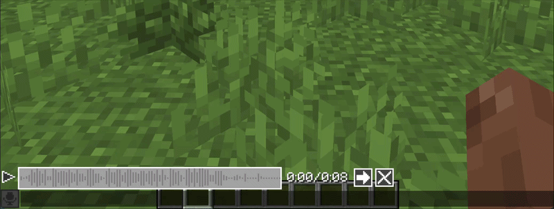
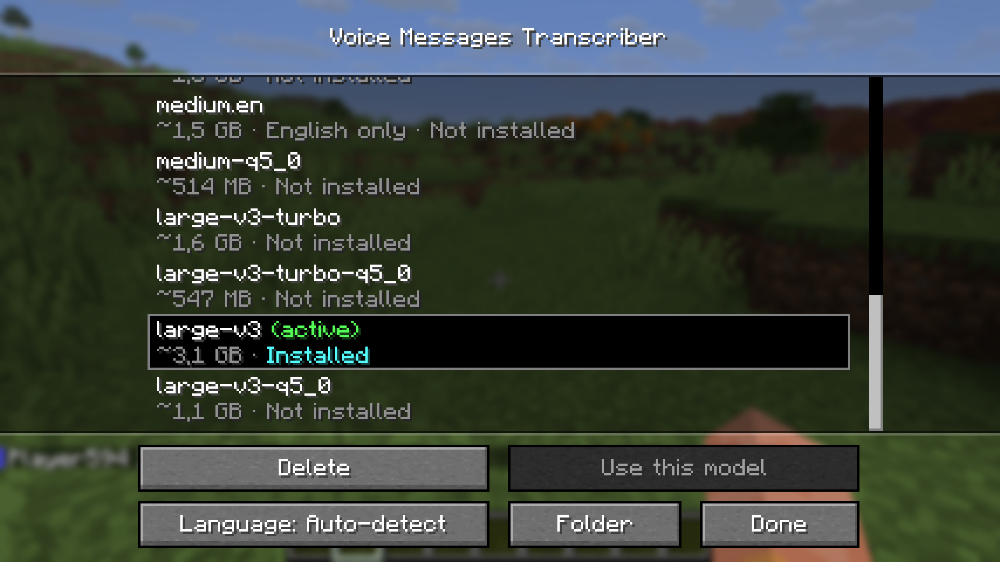

# Voice Messages Transcriber

Fabric addon for the [Voice Messages](https://modrinth.com/plugin/voicemessages) mod. Adds a transcription button in the right of voice messages in the chat.

This mod uses [GGML Whisper](https://github.com/ggml-org/whisper.cpp) models with [JNI-wrapper](https://github.com/GiviMAD/whisper-jni). 

You can download and select models in the config menu , that can be opened from [Mod Menu](https://modrinth.com/mod/modmenu) or by right-clicking a transcription button in the chat.

